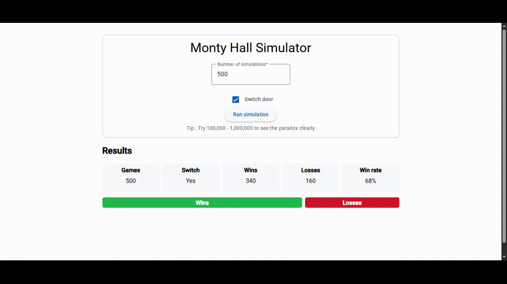

# Monty Hall Problem Simulator

This is a web application that simulates the famous Monty Hall problem. You can run thousands of games to see the probability of winning if you switch or stay with your initial choice.


## Getting Started

### Frontend

The frontend for this application is implemented with **Angular 19**, providing the user-friendly UI with Angular Material.

1. **Install dependencies:**

   ```bash
   cd client
   npm install
   ```

2. **Run the app:**
   ```bash
   ng serve
   ```
   Then open [http://localhost:4200](http://localhost:4200) in your browser.

### Backend

The backend for this application is implemented with **.NET Core 8**, providing the simulation logic and API endpoints.

To run the backend:

```bash
cd server
dotnet run
```

## How to Play

1. **Enter Number of Games:**  
   Input how many games you want to simulate (between 1 and 5,000,000).

2. **Choose Strategy:**  
   Select whether you want to switch your choice after the host reveals a goat, or stay with your original door.

3. **Run Simulation:**  
   Click the "Run Simulation" button. The app will show you the number of wins and losses for your chosen strategy.

4. **View Results:**  
   Results are displayed in a grid and with colored bars for easy visualization.





## Acknowledgements

- [Angular](https://angular.dev/)
- [Angular Material](https://material.angular.dev/)
- [dotnet](https://dotnet.microsoft.com/en-us/)
